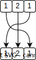

# 9. Palindrome Number

- Level: Easy 🟢

Given an integer `x`, return `true` if `x` is a
palindrome, and `false` otherwise.

### Example 1
```
Input: x = 121
Output: true
Explanation: 121 reads as 121 from left to right and from right to left.
```

### Example 2
```
Input: x = -121
Output: false
Explanation: From left to right, it reads -121. From right to left, it becomes 121-. Therefore it is not a palindrome.
```

### Example 3
```
Input: x = 10
Output: false
Explanation: Reads 01 from right to left. Therefore it is not a palindrome.
```

**Constraints:**
- -2<sup>31</sup> <= x <= 2<sup>31</sup> - 1


**Follow up:** Could you solve it without converting the integer to a string?

---------------------------
# Solution

✅ In this problem because using string make it super simple we try to use the mathematical approach.

## Algorithm

- The negative numbers cannot be palindrome
- We split our number to its digits
- Then we make the reverse number
<p align="center">
    
</p>

- If the reverse number is the input number `true` else `false`
  
